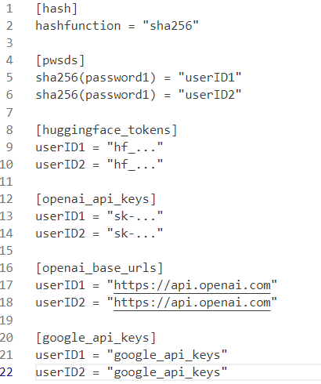

# AiTool

> https://github.com/Komorebi-yaodong/AiTool.git

---

## Getting Started

### token

ChatGPT API: `https://github.com/chatanywhere/GPT_API_free.git`

Gemini API: `https://ai.google.dev/`

### local

```
pip install -r requirements.txt
streamlit run streamlit_app.py
```

### deploy on share.streamlit.io

1. Fork this project
2. Access `https://share.streamlit.io/`and `New app`
3. Waiting to use!

### author channel

According to streamlit using secrets, you need to create a /.streamlit/secrets.toml file has the following content format.



Secret can also be set in the settings of the share.streamlit.io platform. After configuration, it can be automatically filled in by entering the password in the **author channel**. Don't forget to set /.streamlet/secrets. toml added to. gitignore.

## Usage

### Chat function(🤖Chat||💬Talk)

### Translate function(🔤Deeplx)

### Img function(🎨**Text2Img**)

---

## About

> This project is non-profit, please do not use this project for profit purposes
>
> The data from other sites in this project is for reference only.
